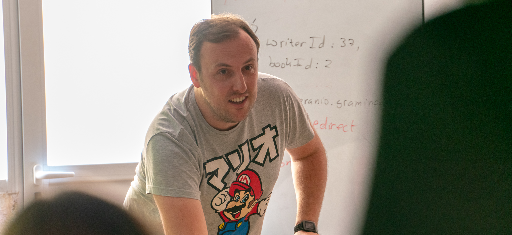

### Hola, soy [Mario][website] -> Profesor y desarrollador senior con expectativas de dominación mundial 👋

## Actualmente me puedes encontrar:
- 👨‍🏫 Head Teacher Bootcamp "Full Stack" en [Neoland][neoland]
- 👨‍💻 Profesor en [AEPI][aepi] (Asociación española de programadores informáticos):
    - Máster profesional de diseño, maquetación web y JQuery [link](https://asociacionaepi.es/curso-profesional-diseno-web/)
    - Curso profesional de Javascript, Ajax, Json y JQuery [link](https://asociacionaepi.es/curso-de-javascript-ajax-json-jquery)
    - Curso desarrollo web profesional full stack en Javascript (Angular, Express, NodeJS y MongoDB) [link](https://asociacionaepi.es/curso-desarrollo-web-profesional-fullstack-con-javascript/)
- 🖥 Desarrollador Web y Móvil Senior
- 🎤 Contador profesional de chorradas

### Contacta conmigo:

[][website]
[][youtube]
[][twitter]
[][linkedin]
[][instagram]

[website]: http://www.mariogiron.com
[neoland]: http://www.neoland.es
[aepi]: https://asociacionaepi.es/
[youtube]: https://www.youtube.com/channel/UC0fQ577yKrm1s8tT67Afu_w
[twitter]: http://www.twitter.com/m_giron
[linkedin]: https://www.linkedin.com/in/mariogironm/
[instagram]: https://www.instagram.com/mariogiron/